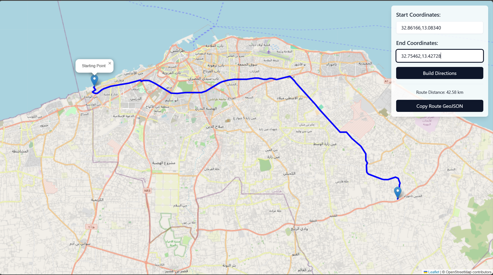

# Leaflet Directions

## Purpose

Leaflet Directions is a web application that allows users to visualize and calculate driving routes between two points on a map. It provides an interactive interface for inputting start and end coordinates, and displays the route on a Leaflet-based map using the OpenRouteService API.

## Features

- Interactive map display using Leaflet
- Input fields for start and end coordinates
- Route calculation and display using OpenRouteService API
- Copy route GeoJSON to clipboard (try pasting it into https://geojson.io/)
- Responsive design with Tailwind CSS
- Dark mode support

## Technologies and Packages Used

- HTML5
- JavaScript (ES6+)
- [Leaflet](https://leafletjs.com/) - An open-source JavaScript library for mobile-friendly interactive maps
- [OpenRouteService API](https://openrouteservice.org/) - For route calculation and directions
- [Tailwind CSS](https://tailwindcss.com/) - A utility-first CSS framework
- [OpenStreetMap](https://www.openstreetmap.org/) - Provides the map tiles

## Setup and Usage

1. Clone this repository to your local machine.
2. Open the `index.html` file in a web browser.
3. Enter the start and end coordinates in the input fields (format: latitude,longitude).
4. Click the "Build Directions" button to calculate and display the route.

## API Key

This project uses the OpenRouteService API. The current API key is included in the code for demonstration purposes. For production use, please obtain your own API key from [OpenRouteService](https://openrouteservice.org/) and replace it in the JavaScript code.

## Contributing

Contributions to Leaflet Directions are welcome! If you'd like to contribute, please follow these steps:

1. Fork the repository.
2. Create a new branch for your feature or bug fix.
3. Make your changes and commit them with descriptive commit messages.
4. Push your changes to your fork.
5. Submit a pull request to the main repository.

Please ensure that your code adheres to the existing style and includes appropriate documentation.

## License

[MIT License](LICENSE)

## Acknowledgements

- Leaflet contributors
- OpenRouteService team
- OpenStreetMap contributors
- Tailwind CSS team
